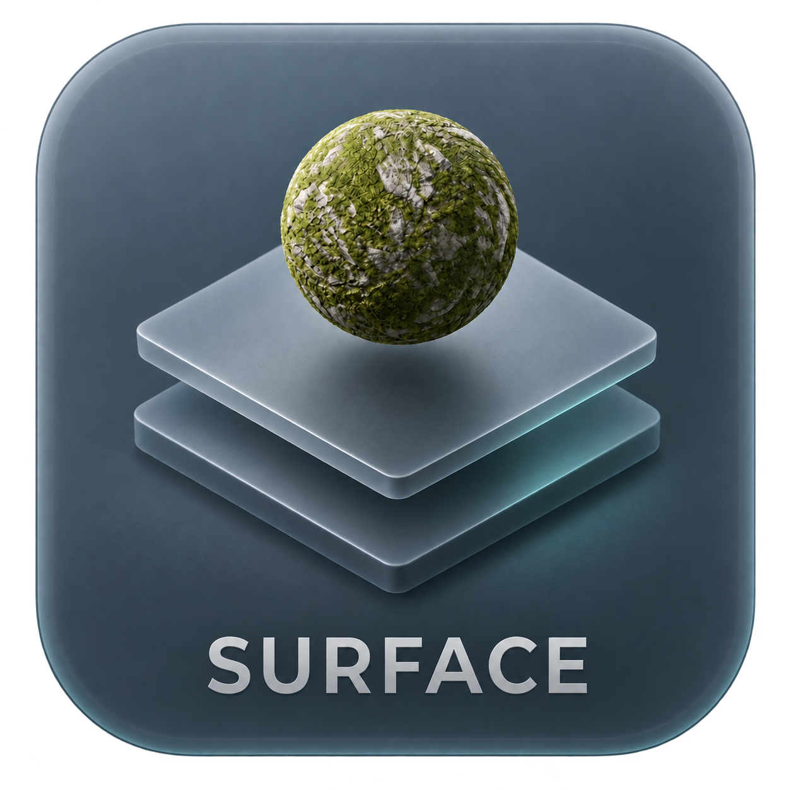

<p align="center"></p>

# Surface Studio

**本地 PBR 材质管理器，让材质库与 Blender 创作工作流连接。**

Surface Studio（SS）是一款 Windows 桌面工具，读取已有材质文件夹，提供预览、搜索、分类、收藏、集合和对比，并通过配套 Blender 插件给模型或选中的面赋材质。青灰磨砂玻璃界面、一体化无边框窗口，无需登录账号或上传素材。

## 下载与启动

从 **[Releases](https://github.com/XXLDinosaur/SurfaceStudio/releases/latest)** 下载 Windows 便携包。GitHub 的 Download ZIP 是源码，不是安装包。

1. 完整解压到可写目录，双击 `Surface Studio.exe`。
2. 在左下角 **材质库设置** 选择自己的素材目录，保存并扫描。
3. 开始搜索和浏览；程序包不包含材质贴图。

要求 Windows 10 / 11 x64 和 Microsoft Edge WebView2 Runtime。便携包内置 Python 环境，无需另外安装 Python。WebView2 可从 [Microsoft 官方页面](https://developer.microsoft.com/microsoft-edge/webview2/) 获取。

> 关闭窗口后，本地服务继续在后台运行，供 Blender 联动使用。更新 EXE 前，先退出任务管理器中的 Surface Studio.exe 后台进程。保留原 `data` 目录，不要用空配置覆盖已有收藏和设置。

## 功能

| 功能 | 说明 |
| --- | --- |
| 本地索引 | 材质子目录、Quixel / Megascans 元信息、PBR 贴图与预览 |
| 搜索筛选 | 名称、标签、中英文关键词；分类、分辨率、通道和平铺筛选 |
| 浏览 | 紧凑、标准、大图、列表；固定搜索栏 |
| 整理 | 收藏、最近浏览、自建集合、集合编辑 |
| 预览对比 | 已有材质球图、颜色贴图、平铺预览、放大、双材质对比 |
| 桌面交互 | 自定义右键菜单、打开目录、复制路径、窗口拖动与缩放 |
| 外观 | 浅色 / 深色，标准 / 舒适 / 大字字号 |
| Blender | Principled PBR 节点、对象或选中面赋材质、自动 UV、可选凹凸 |

顶部空白处拖动窗口，双击最大化或还原；右上角控制最小化、最大化和关闭。`Ctrl+K` 聚焦搜索，`Esc` 关闭详情或弹层。非输入状态下按 `F` 收藏当前材质。“精选专题”默认收起，卡片大小和阅读字号独立设置。

## 素材目录

```text
我的材质库/
  Rock_4K/
    Rock_Preview.png
    Rock_4K_Albedo.jpg
    Rock_4K_Normal.jpg
    Rock_4K_Roughness.jpg
    Rock_4K_Displacement.jpg
    metadata.json            # 可选
  Concrete_4K/
    ...
```

选择包含各个材质子文件夹的目录。支持中文路径和常见 Bridge 结构，缺少 JSON 的目录也可索引。新增或删除素材后重新扫描。

原材质只读访问，不搬动、不重命名。材质球使用资源库已有预览图，**不是实时 PBR 渲染器**。EXR 预览依赖同通道 JPG 代理，不建议只有 EXR、没有代理图的资源包。

## Blender 联动

支持 Blender 4.2+；开发期间在 4.2.4 LTS 和 5.1.2 验证过，其他版本尚未逐一测试。

1. 从 Release 下载 `surface_studio_bridge.zip`。
2. Blender → 编辑 → 偏好设置 → 插件 → 从磁盘安装，选择 ZIP 并启用。
3. 在插件偏好设置中指定实际的 `Surface Studio.exe` 路径。
4. 3D 视图按 `N` → Surface Studio，选中网格模型，点击“打开材质库”。
5. 在 SS 中选择材质、检查目标模型，点击“赋予到 Blender”。

对象模式赋予选中模型，编辑模式只作用于选中的面。支持颜色空间、AO、平铺、可选高度凹凸及 DirectX 法线翻转。原材质槽保留，赋予操作可以 `Ctrl+Z` 撤销。

贴图按本地路径引用，不自动打包进 `.blend`。移动工程时保持贴图可访问，或在 Blender 中打包外部资源。详见 [插件说明](blender_addon/surface_studio_bridge/README.md)。

## 源码运行

建议 Windows x64 + Python 3.12：

```powershell
python -m venv .venv
.\.venv\Scripts\python.exe -m pip install -r requirements.txt
.\.venv\Scripts\python.exe desktop.py
```

首次使用项目旁的 `materials` 目录，可在设置中更换。已有 `data/config.json` 优先于默认值。

只开发网页界面时运行 `python server.py`，浏览器访问 `http://127.0.0.1:47831`。浏览器模式不显示原生窗口按钮，无边框功能由 `desktop.py` 提供。

## 打包

```powershell
.\.venv\Scripts\python.exe -m pip install -r requirements-dev.txt
.\build.ps1 -Python .\.venv\Scripts\python.exe
.\.venv\Scripts\python.exe package_addon.py
```

EXE 输出到 `dist/Surface Studio.exe`，插件输出为 `surface_studio_bridge.zip`。PyInstaller 需要在 Windows 上构建。分发时不要包含个人 `data`、浏览器配置或素材文件。

## 测试

```powershell
.\.venv\Scripts\python.exe -m unittest test_server test_bridge
& '你的Blender安装目录\blender.exe' --background --factory-startup --python-exit-code 1 --python test_blender.py
```

服务和消息邮箱测试使用临时目录。Blender 测试使用工厂启动配置，不操作自己的模型或偏好设置。开发期间还检查过搜索、列表、筛选、右键、字号和真实原生窗口控制；这些界面检查依赖本机环境，尚未配置跨平台 CI。

## 数据与隐私

| 位置 | 内容 |
| --- | --- |
| `data/config.json` | 素材库路径 |
| `data/state.json` | 收藏、集合、最近浏览；建议备份 |
| `data/index.json` | 可通过扫描重建的索引 |
| `data/thumbnails/` | 可重建的缩略图缓存 |
| `data/webview-profile/` | 主题与字号等浏览器状态 |
| `data/blender/` | Blender 本地连接和请求文件 |

服务只监听本机 `127.0.0.1:47831`，不要直接暴露到公网。仓库不包含真实素材库、收藏、浏览记录或本机配置。软件运行不要求云服务，安装依赖和下载版本需要网络。

## 常见问题

- **无法启动**：检查 WebView2 Runtime、目录写权限，以及 47831 端口是否被占用。
- **更新后还是旧界面**：退出旧 SS 后台进程再启动新版。
- **Blender 未连接**：检查插件启用状态和 EXE 路径，从 Blender 侧栏打开材质库。
- **没有缩略图**：检查预览图是否存在；EXR 需要可用代理图。
- **主题或字号重置**：从旧 Edge 独立窗口迁移到 WebView2 需重新选择一次，收藏不受影响。

## 项目结构

```text
desktop.py             # WebView2 桌面宿主
server.py              # 本地服务、索引、图片预览
blender_bridge.py      # Blender 消息邮箱
public/                # 界面与图标
blender_addon/         # Blender 插件
build.ps1              # EXE 打包
package_addon.py       # 插件打包
```

当前面向 Windows 和 Blender，没有 Revit 或 SketchUp 直接赋材质插件，不提供云同步、素材下载或材质授权。使用者需自行准备有权使用的资源。

## 许可与说明

项目暂未选择开源许可证；上传到 GitHub 不等于授予开源使用许可。图标基于设计参考经 AI 辅助制作。本项目与 Quixel / Epic Games / Blender Foundation 无隶属关系。
